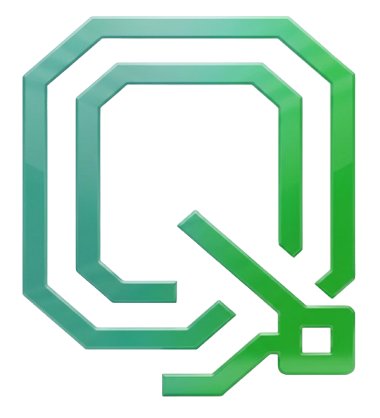

<p align="center">
  
</p>

<h1 align="center">QAStarter</h1>

<p align="center">
  <strong>Free QA Automation Framework Generator</strong>
</p>

<p align="center">
  Create production-ready test automation frameworks instantly.<br>
  Selenium, Playwright, Cypress, Appium, RestAssured & more.
</p>

<p align="center">
  <a href="https://github.com/QATonic/QAStarter/stargazers">
    
  </a>
  <a href="https://github.com/QATonic/QAStarter/network/members">
    
  </a>
  <a href="https://github.com/QATonic/QAStarter/blob/main/LICENSE">
    
  </a>
  <a href="https://github.com/QATonic/QAStarter/issues">
    
  </a>
</p>

<p align="center">
  <a href="https://qastarter.qatonic.com"><strong>Live Demo</strong></a> •
  <a href="#-features">Features</a> •
  <a href="#-quick-start">Quick Start</a> •
  <a href="#-supported-technologies">Technologies</a> •
  <a href="#-contributing">Contributing</a> •
  <a href="#-license">License</a>
</p>

---

## ✨ Features

- 🚀 **Instant Generation** - Create complete test automation projects in seconds
- 🎯 **46+ Templates** - Covering web, mobile, API, and desktop testing
- 🔧 **Production Ready** - Page Object Model, utilities, config, and more included
- 📊 **CI/CD Integration** - GitHub Actions, GitLab CI, Azure DevOps, Jenkins, CircleCI
- 📈 **Reporting Tools** - Allure, ExtentReports, HTML reports
- 🐳 **Docker Support** - Optional Dockerfile and Docker Compose for containerized testing
- 🌐 **No Signup Required** - 100% free, instant download

## 🛠️ Supported Technologies

### Testing Frameworks
| Web | Mobile | API | Desktop |
|-----|--------|-----|---------|
| Selenium | Appium | RestAssured | WinAppDriver |
| Playwright | Espresso | Requests | PyAutoGUI |
| Cypress | XCUITest | SuperTest | |
| WebdriverIO | | RestSharp | |

### Languages
- Java (TestNG, JUnit5)
- Python (pytest)
- JavaScript/TypeScript (Mocha, Jest)
- C# (NUnit, MSTest)

### Build Tools
- Maven, Gradle (Java)
- npm (JavaScript/TypeScript)
- pip (Python)
- NuGet (C#)

## 🚀 Quick Start

### Using the Web App

1. Visit [qastarter.qatonic.com](https://qastarter.qatonic.com)
2. Select your testing type, framework, and language
3. Configure CI/CD, reporting, and utilities
4. Click "Generate & Download"
5. Extract and start testing!

### Running Locally

```bash
# Clone the repository
git clone https://github.com/QATonic/QAStarter.git
cd QAStarter

# Install dependencies
npm install

# Start development server
npm run dev

# Build for production
npm run build
```

## 📁 Project Structure

```
QAStarter/
├── client/                 # React frontend (Vite + TypeScript)
│   ├── src/
│   │   ├── components/     # UI components
│   │   └── pages/          # Page components
│   └── public/             # Static assets
├── server/                 # Express backend
│   ├── templates/          # Template packs
│   │   └── packs/          # 46+ template configurations
│   └── services/           # Business logic
├── shared/                 # Shared code (validation, schemas)
└── dist/                   # Production build
```

## 🤝 Contributing

We welcome contributions! Please see our [Contributing Guide](CONTRIBUTING.md) for details.

### Ways to Contribute
- 🐛 Report bugs and issues
- 💡 Suggest new features or templates
- 📝 Improve documentation
- 🔧 Submit pull requests

## 📜 License

This project is licensed under the MIT License - see the [LICENSE](LICENSE) file for details.

## 🙏 Support

If you find QAStarter helpful, please consider:

- ⭐ **Starring** the repository
- 🍴 **Forking** to contribute
- ☕ **Supporting** on [Buy Me a Coffee](https://buymeacoffee.com/santoshkarad)

---

<p align="center">
  Made with ❤️ by <a href="https://github.com/QATonic">QATonic Innovations</a>
</p>

<p align="center">
  <a href="https://www.linkedin.com/company/qatonic">LinkedIn</a> •
  <a href="https://x.com/qatonicinnovate">Twitter</a> •
  <a href="https://www.youtube.com/@qatonicinnovations">YouTube</a>
</p>
